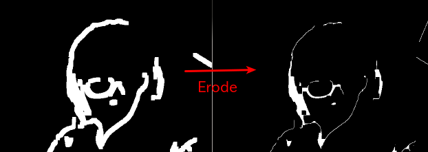
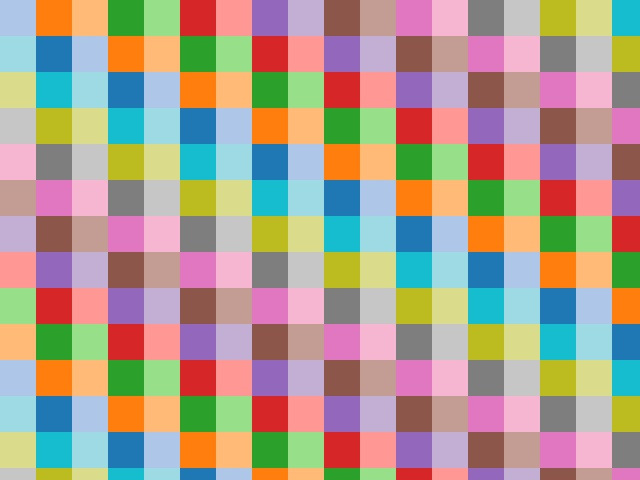
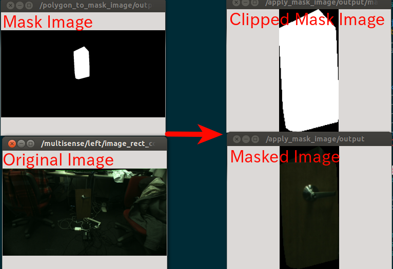
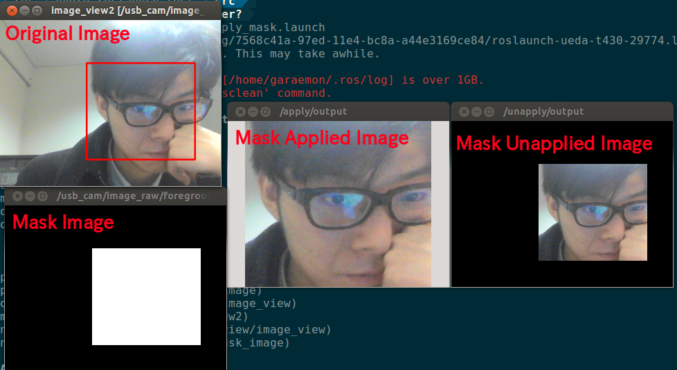
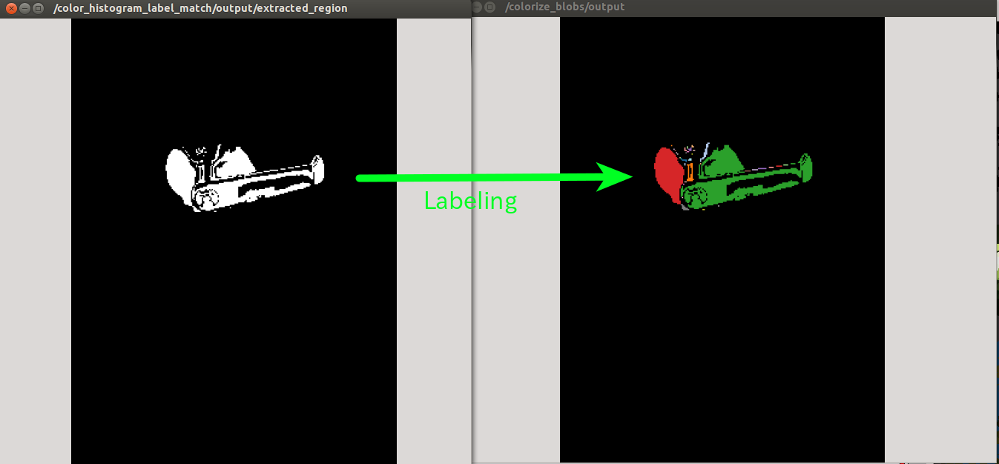
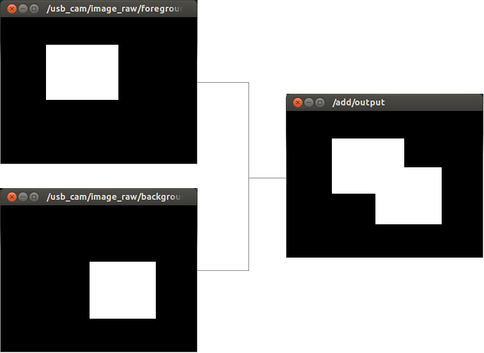
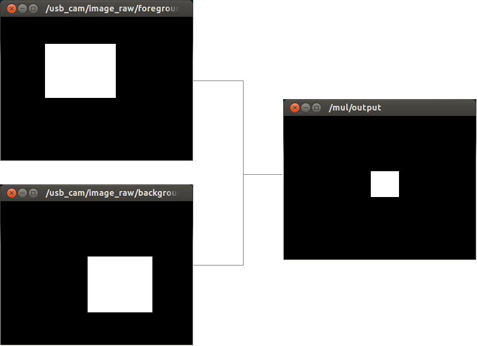

# jsk_perception

## nodes and nodelets

### jsk\_pcl/RectToROI
Convert rectangle (`geometry_msgs/Polygon`) into ROI with camera info (`sensor_msgs/CameraInfo`).

We expect it will be used with image_view2.

#### Subscribing Topic
* `~input` (`geometry_msgs/Polygon`)

  Polygon to represent rectangle region of image.
* `~input/camera_info` (`sensor_msgs/CameraInfo`)

  Original camera info.

#### Publishing Topic
* `~output` (`sensor_msgs/CameraInfo`)

  camera info with ROI filled by `~input`.

### jsk\_pcl/ROIToRect
Convert camera info with ROI to `geometry_msgs/PolygonStamped`.

#### Subscribing Topic
* `~input` (`sensor_msgs/CameraInfo`)

  Input camera info with ROI filled.

#### Publishing Topic
* `~output` (`geometry_msgs/PolygonStamped`)

  Output rectangle region.

### jsk\_pcl/RectToMaskImage
Convert rectangle (`geometry_msgs/Polygon`) into mask image (`sensor_msgs/Image`)

We expect it will be used with image_view2.

#### Subscribing Topic
* `~input` (`geometry_msgs/Polygon`)

  Polygon to represent rectangle region of image.
* `~input/camera_info` (`sensor_msgs/CameraInfo`)

  Original camera info.

#### Publishing Topic
* `~output` (`sensor_msgs/Image`)

  Mask image.

### jsk\_perception/PolygonToMaskImage

Convert polygon into mask image.

#### Subscribing Topic
* `~input` (`geometry_msgs/PolygonStamped`)

  Input 3-D polygon.
* `~input/camera_info` (`sensor_msgs/CameraInfo`)

  Input camera info to project 3-D polygon.

#### Publishing Topic
* `~output` (`sensor_msgs/Image`)

  Mask image to fill `~input` polygon. Currently only convex polygon is supported.

### jsk\_perception/ROIToMaskImage
Convert camera info with ROI to mask image.

#### Subscribing Topic
* `~input` (`sensor_msgs/CameraInfo`)

  Input camera info with ROI filled.

#### Publishing Topic
* `~output` (`sensor_msgs/Image`)

  Output mask image.

### jsk\_perception/MaskImageToROI
Convert a mask image into camera info with roi.

#### Subscribing Topic
* `~input` (`sensor_msgs/Image`)

  Input mask image.
* `~input/camera_info` (`sensor_msgs/CameraInfo`)

  Original camera info.

#### Publishing Topic
* `~output` (`sensor_msgs/CameraInfo`)

  Camera info with ROI field filled.

### jsk\_perception/MaskImageToRect
Convert a mask image into geometry_msgs::PolygonStamped.

#### Subscribing Topic
* `~input` (`sensor_msgs/Image`)

  Input mask image.

#### Publishing Topic
* `~output` (`geometry_msgs/PolygonStamped`)

  PolygonStamped message which only contains two points. Minimum point and Maximum point to represent bounding box in image.

### jsk\_perception/ErodeMaskImage

Erode binary image.

#### Subscribing Topic
* `~input` (`sensor_msgs/Image`)

  Input image

#### Publishing Topic
* `~output` (`sensor_msgs/Image`)

  Output eroded image.

#### Parameters
* `~erode_method` (`0`, `1` or `2`, default: `0`)

  Method to erode image. 0 means rectangular box model,
  1 meand cross model and 2 means ellipse.

* `~erode_size` (Integer, default: `1`)

  Size to erode

### jsk\_perception/DilateMaskImage

Dilate binary image.

#### Subscribing Topic
* `~input` (`sensor_msgs/Image`)

  Input image

#### Publishing Topic
* `~output` (`sensor_msgs/Image`)

  Output dilated image.

#### Parameters
* `~dilate_method` (`0`, `1` or `2`, default: `0`)

  Method to dilate image. 0 means rectangular box model,
  1 meand cross model and 2 means ellipse.

* `~dilate_size` (Integer, default: `1`)

  Size to dilate

### jsk\_perception/GridLabel

Generate labels of grid.

#### Subscribing Topic
* `~input` (`sensor_msgs/CameraInfo` or `sensor_msgs/Image`)

  Input is `sensor_msgs/CameraInfo` or `sensor_msgs/Image`.
  If `use_camera_info` is true, `sensor_msgs/CameraInfo` will be used.
  If `use_camera_info` is false, `sensor_msgs/Image` will be used.
#### Publishing Topic
* `~output` (`sensor_msgs/Image (CV_32SC1)`)

  Output labels as image. Encoding is `CV_32SC1`.
#### Parameters
* `~label_size` (Integer, default: `32`)

  label size
* `~use_camera_info` (Boolean, default: `false`)

  if this parameter is true, it uses `sensor_msgs/CameraInfo` for `~input`.

### jsk\_perception/ApplyMaskImage

Apply mask image to original image and visualize it. It's a utlity to visualize mask image.

#### Subscribing Topic
* `~input` (`sensor_msgs/Image`)

  Original image.
* `~input/mask` (`sensor_msgs/Image`)

  Mask image.
#### Publishing Topic
* `~output` (`sensor_msgs/Image`)

  Masked image. The image is clipped by bounding box of mask image and filtered by the mask.
  The region not specified by mask image is filled by 0.
* `~output/mask` (`sensor_msgs/Image`)

  Clipped mask image. The image is clipped by bounding box of mask image.

#### Parameters
* `~approximate_sync` (Bool, default: `false`)

  Approximately synchronize inputs if it's true.

### jsk\_perception/UnpplyMaskImage

Unapply mask image to the size of original image.

#### Subscribing Topic
* `~input` (`sensor_msgs/Image`)

  Masked image.
* `~input/mask` (`sensor_msgs/Image`)

  Mask image.
#### Publishing Topic
* `~output` (`sensor_msgs/Image`)

  Unmasked image. The region outside of mask image is filled by black (0).

#### Parameters
* `~approximate_sync` (Bool, default: `false`)

  Approximately synchronize inputs if it's true.

### jsk\_perception/SLICSuperPixels

Compute super pixels based on SLIC based on "SLIC Superpixels Compared to State-of-the-art Superpixel Methods" (TPAMI 2012).
jsk\_perception use implementation of https://github.com/PSMM/SLIC-Superpixels, https://github.com/berak/SLIC-Superpixels and https://github.com/garaemon/SLIC-SuperPixels.

Output of this node is an image and each value means label index.

#### Subscribing Topic
* `~input` (`sensor_msgs/Image`)

  Input image.
#### Publishing Topic

* `~output` (`sensor_msgs/Image`)

  Output image. The encoding of image is `CV_32SC1` and each element value means label index.
* `~debug` (`sensor_msgs/Image`)

  Debug image, each border of cluster drawn by red contour.
* `~debug/mean_color` (`sensor_msgs/Image`)

  Debug image, each cluster is drawn by mean color of the cluster.
* `~debug/center_grid` (`sensor_msgs/Image`)

  Debug image, Center of each cluster is plotted by red dot.
#### Parameters
* `~number_of_super_pixels` (Integer, default: `100`)

  The number of super pixels.
* `~weight` (Integer, default: `4`)

  Weight of metrics between color and pixel distance.

### jsk\_perception/LabDecomposer
Decompose BGR/RGB image into separate planes in [CIE-Lab color space](http://en.wikipedia.org/wiki/Lab_color_space).

#### Subscribing Topic
* `~input` (`sensor_msgs/Image`)

  Input image.
#### Publishing Topic
* `~output/l` (`sensor_msgs/Image`)
* `~output/a` (`sensor_msgs/Image`)
* `~output/b` (`sensor_msgs/Image`)
  L*, a and b separated planes. Each image has CV_8UC encoding.

### jsk\_perception/YCCDecomposer
Decompose BGR/RGB image into separate planes in [YCbCr color space](http://en.wikipedia.org/wiki/YCbCr).

#### Subscribing Topic
* `~input` (`sensor_msgs/Image`)

  Input image.
#### Publishing Topic
* `~output/y` (`sensor_msgs/Image`)
* `~output/cr` (`sensor_msgs/Image`)
* `~output/cb` (`sensor_msgs/Image`)
  Y, Cr and Cb separated planes. Each image has CV_8UC encoding.

### jsk\_perception/SingleChannelHistogram
Compute histogram of single channel image.

#### Subscribing Topic
* `~input` (`sensor_msgs/Image`)

  Input image. It should has CV_8UC1 as encoding.

* `~input/mask` (`sensor_msgs/Image`)

  Mask image. if `~use_mask` is true, histogram is computed with this mask image.
#### Publishing Topic
* `~output` (`jsk_recognition_msgs/ColorHistogram`)

  Histogram of `~input` image.

#### Parameters
* `~use_mask` (Boolean, default: `false`)

  If this parameter is set true, histogram is computed with mask image.

* `~hist_size` (Integer, default: `10`)

  The number of bins of histogram

* `~min_value` (Double, default: `0.0`)
* `~max_value`(Double, default: `255.0`)

  Minimum and maximum value of histogram

### jsk\_perception/BlobDetector

Detect blob of binary image and output label of it.
The implementation is based on [Imura's implementation](http://oshiro.bpe.es.osaka-u.ac.jp/people/staff/imura/products/labeling).

#### Subscribing Topic
* `~input` (`sensor_msgs/Image`)

  Input image. It should be single channel.
#### Publishing Topic
* `~output` (`sensor_msgs/Image`)

  Label image. Each pixel value means the label which the pixel should belong to and 0 means
  the pixel is masked (black in `~input` image)

#### Parameter
* `~min_size` (Integer, default: `10`)

  Minimum size of blob

### jsk\_perception/AddMaskImage

Add two mask image into one mask image.

#### Subscribing Topic
* `~input/src1` (`sensor_msgs/Image`)
* `~input/src2` (`sensor_msgs/Image`)

  Input mask images.
#### Publishing Topic
* `~output` (`sensor_msgs/Image`)

  Added mask image.
#### Parameters
* `~approximate_sync` (Bool, default: `false`)

  Approximately synchronize `~input/src1` and `~input/src2` if it's true.

### jsk\_perception/MultiplyMaskImage

Multiply (bitwise) two mask image into one mask image.

#### Subscribing Topic
* `~input/src1` (`sensor_msgs/Image`)
* `~input/src2` (`sensor_msgs/Image`)

  Input mask images.
#### Publishing Topic
* `~output` (`sensor_msgs/Image`)

  Added mask image.
#### Parameters
* `~approximate_sync` (Bool, default: `false`)

  Approximately synchronize `~input/src1` and `~input/src2` if it's true.
